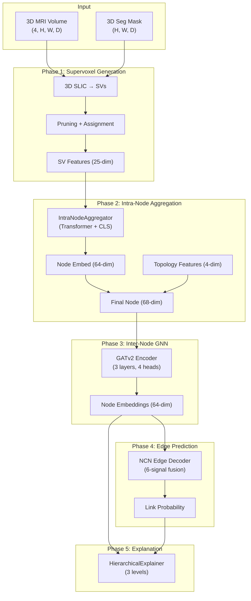

# GNN Architecture: Hierarchical Supervoxel-Segmentation Graph Neural Network

> **File**: [`gnn.py`](file:///home/mushahidintesum/Documents/arche/gnn.py) (~1680 lines)
> **Role**: Phase 4 of the ARCHE brain tumor analysis pipeline — takes 3D MRI volumes + segmentation masks → constructs tumor graphs → predicts tissue connectivity → generates multi-level explanations.

---

## Table of Contents

1. [Architecture Overview](#architecture-overview)
2. [Node Feature Extraction (35-dim, flat path)](#node-feature-extraction-35-dim)
3. [Boundary Features](#boundary-features)
4. [Cross-Modal Features](#cross-modal-features)
5. [Graph Construction (Flat Path)](#graph-construction-flat-path)
6. [Hierarchical Graph Construction (SVGFormer Path)](#hierarchical-graph-construction)
7. [Supervoxel Aggregation (IntraNodeAggregator)](#supervoxel-aggregation)
8. [OCN Structural Features](#ocn-structural-features)
9. [Intra-Node Topology](#intra-node-topology)
10. [NCN Encoder (GATv2)](#ncn-encoder)
11. [NCN Edge Decoder](#ncn-edge-decoder)
12. [Full Model (NCNEdgePredictor)](#full-model)
13. [Training & Evaluation](#training--evaluation)
14. [3-Level Explanation System](#3-level-explanation-system)
15. [Visualization](#visualization)
16. [Dimension Summary](#dimension-summary)

---

## Architecture Overview



The system has two paths:
- **Flat path** (`build_3d_graph`): Legacy 2D-slice-based graph with 35-dim handcrafted node features. Used as fallback when 3D volumes are unavailable.
- **Hierarchical path** (`build_hierarchical_graph`): 3D supervoxel-based with Transformer aggregation + OCN topology = 68-dim node features. The primary architecture.

---

## Node Feature Extraction (35-dim)

> [compute_region_raw_features](file:///home/mushahidintesum/Documents/arche/gnn.py#L36-L49) | [extract_regions_multiclass](file:///home/mushahidintesum/Documents/arche/gnn.py#L87-L140)

Each connected component (segmentation region) in a 2D slice is described by a **35-dimensional** feature vector. This is used in the flat path.

### Feature Vector Layout

| Dims | Category | Features | Purpose |
|------|----------|----------|---------|
| 0–2 | **3D Position** | `cx/W`, `cy/H`, `z/D` | Normalized spatial location in the volume |
| 3–7 | **Morphology** | area, width, height, aspect_ratio, solidity | Shape characterization of the component |
| 8–10 | **Tissue One-Hot** | `[NCR, ED, ET]` | Which tissue type this region belongs to |
| 11–26 | **Raw Intensity** | 4 modalities × 4 stats | Per-channel intensity statistics (see below) |
| 27–28 | **Boundary** | gradient, texture | Edge sharpness and texture contrast |
| 29–32 | **Cross-Modal** | 4 ratios | Inter-modality signal relationships |
| 33–34 | **Slice Context** | z_norm, tumor_ratio | Global slice-level information |

### Per-Modality Intensity Statistics (16 dims)

For each of the 4 MRI modalities (T1n, T1c, T2w, T2f), we compute:

| Stat | Formula | What It Captures |
|------|---------|------------------|
| **Mean** | `μ = Σ pixels / N` | Average signal intensity in the region |
| **Std** | `σ = √(Σ(x-μ)²/N)` | Signal heterogeneity within the region |
| **Range** | `max - min` | Dynamic range — enhancing vs non-enhancing tissue |
| **Skewness** | `E[((x-μ)/σ)³]` | Asymmetry of the intensity distribution |

> [!NOTE]
> **Why these 4 stats?** Mean captures the characteristic signal level of each tissue type (ET is bright on T1c, ED is bright on T2w/FLAIR). Std captures internal heterogeneity (necrotic cores are highly heterogeneous). Range distinguishes homogeneous edema from mixed-signal areas. Skewness detects partial volume effects at tissue boundaries.

---

## Boundary Features

> [compute_boundary_features](file:///home/mushahidintesum/Documents/arche/gnn.py#L52-L67)

**2 dimensions** capturing the sharpness and texture contrast at the edge of each segmentation component.

### Feature 1: Boundary Gradient Magnitude

```python
dilated = cv2.dilate(component_mask, 3×3 kernel)
boundary = dilated - component_mask          # 1-pixel-wide ring around region
inner = T1c[inside_region].mean()
outer = T1c[boundary_ring].mean()
gradient = |inner - outer|
```

**What it measures**: How sharply the tissue transitions at its boundary. Enhancing tumor (ET) typically has a very sharp boundary on T1c (contrast-enhanced), while edema (ED) has a gradual boundary. This feature helps the GNN distinguish:
- **Sharp boundaries** (ET ↔ NCR): high gradient → strong structural boundary
- **Diffuse boundaries** (ED ↔ normal brain): low gradient → infiltrative pattern

> [!IMPORTANT]
> The gradient is computed on **T1c** (contrast-enhanced T1) specifically because contrast enhancement creates the most diagnostically relevant boundaries. Post-gadolinium T1c highlights the active tumor margin where the blood-brain barrier is disrupted.

### Feature 2: Local Texture Contrast

```python
local_mean = convolve(T1c, 3×3 averaging kernel)
local_var  = convolve((T1c - local_mean)², 3×3 averaging kernel)
texture    = mean(local_var[inside_region])
```

**What it measures**: Intra-region texture complexity. This is a proxy for tissue homogeneity:
- **Low texture** → smooth, uniform tissue (healthy brain, pure edema)
- **High texture** → complex internal structure (necrotic core with hemorrhage, mixed solid+cystic tumor)

---

## Cross-Modal Features

> [compute_crossmodal_features](file:///home/mushahidintesum/Documents/arche/gnn.py#L70-L82)

**4 dimensions** capturing diagnostic ratios between MRI modalities. These features encode clinical domain knowledge about how different tissue types appear across modalities.

### Feature Breakdown

| Feature | Formula | Clinical Meaning |
|---------|---------|------------------|
| **Enhancement Ratio** | `T1c_mean / T1n_mean` | Gadolinium uptake. High → active tumor (ET), Low → necrosis or edema. This is the single most important radiological marker for enhancing tumor. |
| **Edema Signal** | `T2w_mean / T2f_mean` | T2/FLAIR ratio. Distinguishes vasogenic edema (high T2, suppressed on FLAIR) from tumor-related edema (high on both). |
| **T1c–T2w Difference** | `T1c_mean − T2w_mean` | Separates enhancing tumor (high T1c, variable T2w) from edema (low T1c, high T2w). A strong positive value indicates active enhancement. |
| **FLAIR–T2w Difference** | `T2f_mean − T2w_mean` | Identifies regions where FLAIR adds signal beyond T2w — typically peritumoral infiltration or gliosis. |

> [!TIP]
> **Why ratios instead of raw values?** Raw intensities vary across scanners, field strengths, and patients. Ratios are inherently normalized — the T1c/T1n enhancement ratio is approximately scanner-invariant, making the feature generalizable across BraTS cases from different institutions.

### Diagnostic Decision Tree (What the Model Learns)

```
Enhancement Ratio > 1.5?
├── YES → Likely ET (enhancing tumor)
│   └── High texture? → Heterogeneous enhancement (aggressive)
│   └── Low texture? → Solid enhancement (well-defined)
├── NO → Non-enhancing
│   ├── Edema Signal > 1.2? → Edema (ED)
│   │   └── FLAIR-T2w diff high? → Infiltrative edema
│   │   └── FLAIR-T2w diff low? → Pure vasogenic edema
│   └── Edema Signal ≤ 1.2? → Necrotic Core (NCR)
│       └── High range? → Hemorrhagic necrosis
│       └── Low range? → Cystic necrosis
```

---

## Graph Construction (Flat Path)

> [build_3d_graph](file:///home/mushahidintesum/Documents/arche/gnn.py#L145-L252)

The flat path builds a graph from 2D segmentation slices stacked into 3D.

### Node Creation
- For each 2D slice, extract connected components per tissue type (NCR=1, ED=2, ET=3)
- Each component with `area ≥ min_region_area` becomes a node
- Node position: `(cx, cy, slice_idx)` — 3D coordinate

### Edge Construction

#### Intra-Slice Edges (KNN)
Within each axial slice, connect nodes via **K-nearest neighbors** (k=5 by default) based on 2D centroid distance:
```
slice_z=45: [NCR₁] ---KNN--- [ET₁] ---KNN--- [ED₁]
```

#### Inter-Slice Edges (Spatial + Tissue Compatibility)
Between adjacent slices (gap ≤ 2), connect nodes if:
1. **Spatial proximity**: 2D centroid distance < `inter_slice_dist_thresh` (50 pixels)
2. **Tissue compatibility**: one of:
   - Same tissue type (`NCR ↔ NCR`)
   - Adjacent types (`NCR ↔ ED`, `ED ↔ ET`)
   - Special pair: `NCR ↔ ET` (necrotic core touches enhancing rim)

> [!NOTE]
> **Why tissue compatibility?** Not all tissue pairs form meaningful connections. Connecting background to enhancing tumor would add noise. The compatibility rules encode the known spatial relationships in glioblastoma: the enhancing rim (ET) surrounds the necrotic core (NCR), and peritumoral edema (ED) surrounds the enhancing rim.

### Edge Attributes (4-dim)

| Dim | Feature | Range | Meaning |
|-----|---------|-------|---------|
| 0 | Distance | [0, 1] | Normalized centroid distance |
| 1 | Angle | [-1, 1] | Direction of connection (atan2 / π) |
| 2 | Slice Gap | [0, 1] | Axial distance / total slices |
| 3 | Same Tissue | {0, 1} | Binary: do endpoints share tissue type? |

---

## Hierarchical Graph Construction

> [build_hierarchical_graph](file:///home/mushahidintesum/Documents/arche/gnn.py#L336-L480)

The primary path. Instead of flat 2D features, each node is a **3D segmentation component** containing internal supervoxels.

### Pipeline

```
3D MRI + 3D Seg Mask
    │
    ▼
3D SLIC (supervoxel.py) → ~500 supervoxels
    │
    ▼
Prune background SVs → ~100-200 tumor SVs
    │
    ▼
Assign SVs to seg components (spatial overlap)
    │
    ▼
Per-SV: extract 22 features + 3 relative PE = 25-dim
    │
    ▼
Per-component: collect SV features → list of (K_i, 25)
    │                                 build intra-SV KNN edges
    ▼
Inter-component: KNN + tissue compatibility → edge_index
    │
    ▼
PyG Data object with sv_features, sv_edge_indices, n_svs_per_node
```

### Key Difference from Flat Path

| Aspect | Flat Path | Hierarchical Path |
|--------|-----------|-------------------|
| Node source | 2D connected components per slice | 3D connected components across volume |
| Node features | 35-dim handcrafted | 68-dim (64 Transformer + 4 topology) |
| Internal structure | None | Supervoxels with KNN edges |
| Position | (cx, cy, slice_idx) | (cx/H, cy/W, cz/D) normalized 3D |
| Feature learning | Static | Learnable via IntraNodeAggregator |

---

## Supervoxel Aggregation

> [IntraNodeAggregator](file:///home/mushahidintesum/Documents/arche/gnn.py#L257-L333)

### What It Does

Each segmentation node contains K_i supervoxels (varying per node). The aggregator converts this variable-length set into a fixed 64-dim embedding using a Transformer with a learnable [CLS] token.

### Architecture

```
Input: K_i supervoxel features, each 25-dim
    │
    ▼
Linear projection: 25 → 64-dim
    │
    ▼
Prepend [CLS] token → sequence of length K_i + 1
    │
    ▼
2-layer Transformer Encoder (4 heads, GELU, dropout=0.1)
    │
    ▼
[CLS] output → Linear → 64-dim node embedding
    │
    ▼
Dot-product attention weights → (K_i,) for explanation
```

### SV Feature Vector (25-dim, from supervoxel.py)

| Dims | Category | Features |
|------|----------|----------|
| 0–3 | Channel 0 stats | mean, std, skewness, kurtosis |
| 4–7 | Channel 1 stats | mean, std, skewness, kurtosis |
| 8–11 | Channel 2 stats | mean, std, skewness, kurtosis |
| 12–15 | Channel 3 stats | mean, std, skewness, kurtosis |
| 16–17 | Volume + surface | voxel_count, surface_area |
| 18–21 | Shape | compactness, elongation, flatness, sphericity |
| 22–24 | Relative PE | (sv_centroid − parent_centroid) normalized |

> [!TIP]
> **Why [CLS] token aggregation?** Unlike mean/max pooling, the Transformer can learn which supervoxels are most important for a given node. The attention weights directly tell us "SV #7 was 3× more important than SV #2" — this is the foundation of Level 2 explanations.

### Attention for Explainability

After the Transformer forward pass:
```python
sv_out = output[0, 1:]      # all SV embeddings after attention
cls_out = output[0, 0]      # [CLS] embedding
attn = softmax(sv_out · cls_out)  # which SVs did [CLS] attend to?
```

High attention weight → that supervoxel contributed most to the node's representation → it contains the most diagnostically relevant tissue substructure.

---

## OCN Structural Features

> [StructuralFeatureComputer](file:///home/mushahidintesum/Documents/arche/gnn.py#L568-L722)

### Inter-Node Features (5-dim per edge)

For each candidate edge (i, j), we compute features based on the graph topology:

| Dim | Feature | Formula | What It Captures |
|-----|---------|---------|------------------|
| 0 | **CN Count** | `\|N(i) ∩ N(j)\| / max_degree` | How many shared neighbors — higher means more embedded in the same community |
| 1 | **Jaccard** | `\|N(i) ∩ N(j)\| / \|N(i) ∪ N(j)\|` | Normalized overlap — accounts for node degree |
| 2 | **Adamic-Adar** | `Σ_{w ∈ CN} 1/log(deg(w))` | Weighted CN count — rare shared neighbors are more informative |
| 3 | **OCN Residual** | `\|\|cn_signal − proj(cn_signal, span(z_i, z_j))\|\|` | **Novel**: orthogonalized common neighbor signal |
| 4 | **Path-Norm CN** | `\|CN\| / 2hop_reach(i,j)` | CN count normalized by 2-hop reachability |

### OCN Residual (Orthogonalized Common Neighbors)

This is the key contribution from the OCN paper. Standard CN count double-counts structural information already captured by node embeddings.

```
cn_signal = mean(z_w for w in common_neighbors)

# Endpoint embeddings span a 2D subspace
Q, R = QR(stack[z_i, z_j].T)    # orthonormal basis for endpoint subspace

# Project cn_signal onto endpoint subspace and remove it
projection = Q @ (Q.T @ cn_signal)
residual = cn_signal - projection

OCN_residual = ||residual||₂
```

**Intuition**: If `cn_signal` is fully explained by `z_i` and `z_j`, the residual is zero → the common neighbors add no new information. A large residual means the common neighbors encode structural topology that the endpoints alone cannot explain.

### Path-Normalized CN

```
2hop_reach(i, j) = number of 2-hop paths from i to j
path_norm_cn = |CN(i,j)| / 2hop_reach(i,j)
```

**Intuition**: In dense graphs, raw CN count is inflated. Path normalization discounts CN counts in regions where many 2-hop paths exist anyway, surfacing edges where the CN count is surprising given the local density.

---

## Intra-Node Topology

> [compute_intra_node_topology](file:///home/mushahidintesum/Documents/arche/gnn.py#L651-L722)

**4-dim topological fingerprint** per node, computed from the internal supervoxel graph.

| Dim | Feature | Formula | What It Captures |
|-----|---------|---------|------------------|
| 0 | **CN Density** | Mean CN count across all SV pairs | Internal connectivity strength |
| 1 | **Connectivity Ratio** | `actual_edges / max_edges` | How densely connected the internal SVs are |
| 2 | **Degree Variance** | `std(degrees of all SVs)` | Homogeneity — are all SVs equally connected, or are there hub SVs? |
| 3 | **Spectral Gap** | 2nd smallest eigenvalue of Laplacian | Algebraic connectivity — how easy is it to separate the SV graph? |

### Clinical Meaning

```
High CN density + Low degree variance → Homogeneous tissue (pure edema)
Low CN density + High degree variance → Fragmented tissue (necrotic core with islands)
Low spectral gap → Almost disconnected components → Multifocal tumor
High spectral gap → Well-connected → Solid tumor mass
```

These 4 features are concatenated to the 64-dim aggregator output → **68-dim total node feature** fed to the GATv2 encoder.

---

## NCN Encoder

> [NCNEncoder](file:///home/mushahidintesum/Documents/arche/gnn.py#L727-L761)

**3-layer GATv2** (Graph Attention Network v2) with residual connections.

```
Input: (N, 68) node features + (E, 4) edge attributes
    │
    ▼
Linear: 68 → 128 (hidden_dim)
    │
    ▼
┌─ GATv2Conv(128, 32, heads=4) → 128  ─┐
│  LayerNorm + Residual                  │  × 3 layers
│  ELU + Dropout(0.2) (if not last)      │
└────────────────────────────────────────┘
    │
    ▼
Linear: 128 → 64 (embed_dim)
    │
    ▼
Output: (N, 64) node embeddings + attention weights per layer
```

> [!NOTE]
> **Why GATv2 over GCN?** GATv2 has dynamic attention — the attention weight between nodes i and j depends on **both** their features, not just j's. This matters because tissue relationships are asymmetric (ET→NCR is different from NCR→ET). Edge attributes (distance, angle, slice gap, tissue match) are also incorporated into the attention computation.

---

## NCN Edge Decoder

> [NCNEdgeDecoder](file:///home/mushahidintesum/Documents/arche/gnn.py#L766-L812)

**6-signal fusion** decoder that combines multiple evidence channels to predict edge probability.

### Signal Composition

| Signal | Dimension | Computation | What It Captures |
|--------|-----------|-------------|------------------|
| **Hadamard** | 64 | `z_i ⊙ z_j` | Element-wise feature agreement |
| **Concatenation** | 128 | `[z_i; z_j]` | Full pairwise information |
| **CN Pool** | 64 | `mean(z_w for w ∈ CN)` | Neighborhood topology embedding |
| **Structural** | 64 | `Linear(5→64)(OCN_feats)` | Projected OCN structural signal |
| **Tissue Pair** | 64 | `Embedding(9→64)(tissue_pair_id)` | Learned tissue compatibility |
| **Edge Type** | 32 | `Embedding(2→32)(is_inter_slice)` | Intra vs inter-slice bias |

**Total concatenated**: 64 + 128 + 64 + 64 + 64 + 32 = **416-dim**

### MLP Head

```
416 → LayerNorm → Linear(416, 128) → GELU → Dropout(0.3)
    → Linear(128, 64) → GELU → Dropout(0.2)
    → Linear(64, 1) → logit
```

---

## Full Model

> [NCNEdgePredictor](file:///home/mushahidintesum/Documents/arche/gnn.py#L818-L885)

Orchestrates the full forward pass:

```python
# 1. Aggregate SVs → node embeddings (64-dim)
node_embeds, sv_attns = self.aggregator(data.sv_features)

# 2. Compute intra-node topology (4-dim)
topo_feats = sf_computer.compute_intra_node_topology(sv_edges, n_svs)

# 3. Concatenate → 68-dim input
x = cat([node_embeds, topo_feats])

# 4. GATv2 encode → 64-dim embeddings
z = self.encoder(x, edge_index, edge_attr)

# 5. Decode edges
pos_pred = self.decoder(z, pos_edges, structural_feats, cn_list, ...)
neg_pred = self.decoder(z, neg_edges, ...)
```

> The model has a `_use_hierarchy` flag. When `False`, it falls back to using `data.x` directly (flat 35-dim features, zero-padded to 68).

---

## Training & Evaluation

> [train_gnn](file:///home/mushahidintesum/Documents/arche/gnn.py#L935-L952) | [evaluate_gnn](file:///home/mushahidintesum/Documents/arche/gnn.py#L960-L1089)

### Training Loop
- **Per-graph forward/backward** (not batched — graphs vary in size)
- **Loss**: BCEWithLogits on positive edges + negative edges
- **Negative sampling**: Degree-biased (high-degree nodes produce harder negatives)
- **Optimizer**: AdamW (lr=5e-4, weight_decay=1e-4)
- **Scheduler**: OneCycleLR
- **Gradient clipping**: max_norm=1.0

### Evaluation Metrics
- **Overall AUC-ROC / AP**: Standard link prediction metrics
- **Intra-slice AUC**: Performance on same-slice edges
- **Inter-slice AUC**: Performance on cross-slice edges (harder)
- **Tissue-pair scores**: Per-pair (e.g., ET→ED, NCR→NCR) confidence analysis

---

## 3-Level Explanation System

> [HierarchicalExplainer](file:///home/mushahidintesum/Documents/arche/gnn.py#L1156-L1497)

### Level 1 — Structural Evidence: "WHY are these regions connected?"

Reports the OCN structural features for the predicted edge:
```
Level 1 — Structural Evidence (strong):
  Distance: 0.042 | CN: 0.80 | Jaccard: 0.400
  Adamic-Adar: 1.443 | OCN residual: 0.231
  Path-norm CN: 0.667
```

### Level 2 — Supervoxel Attribution: "WHICH parts drove the connection?"

Reports top-k supervoxels per endpoint node with their attention weights:
```
Level 2 — Supervoxel Attribution:
  Source (ET): focused attention (H=0.72)
    SV#3: weight=0.412
    SV#7: weight=0.289
    SV#1: weight=0.156
  Target (NCR): distributed attention (H=1.84)
    SV#12: weight=0.198
    SV#5: weight=0.171
```

Entropy (H) indicates whether the model is focusing on a few SVs (low H → focused) or spreading attention evenly (high H → distributed).

### Level 3 — Spatial Heatmap: "WHERE in the MRI is the evidence?"

Maps SV attention weights back to voxel coordinates:
```python
heatmap = zeros(H, W, D)
for each top-attention SV:
    heatmap[sv_voxel_mask] = attention_weight
```

This produces a 3D volume where bright regions = most important voxels for the prediction.

### Visualization

[plot_hierarchical_explanation](file:///home/mushahidintesum/Documents/arche/gnn.py#L1500-L1579) generates a **4-panel figure**:

| Panel | Content |
|-------|---------|
| 1 | Graph topology with the explained edge highlighted in blue |
| 2 | SV attention heatmap (or bar chart if no 3D volume) |
| 3 | OCN structural feature bar chart (5 features, color-coded) |
| 4 | Full text explanation (monospace, all 3 levels) |

---

## Dimension Summary

### Node Features

| Architecture | Dims | Components |
|-------------|------|------------|
| Flat (legacy) | 35 | 3 position + 5 morphology + 3 tissue + 16 intensity + 2 boundary + 4 cross-modal + 2 context |
| Hierarchical | 68 | 64 aggregator embed + 4 intra-node topology |

### Edge Features

| Type | Dims | Components |
|------|------|------------|
| Edge attributes | 4 | distance, angle, slice_gap, same_tissue |
| Structural (OCN) | 5 | CN, Jaccard, AA, OCN_residual, path_norm_CN |

### Model Dimensions

| Component | In → Out |
|-----------|----------|
| IntraNodeAggregator | (K_i, 25) → 64 |
| NCNEncoder | 68 → 128 → 64 |
| NCNEdgeDecoder | 416 → 128 → 64 → 1 |
| Total parameters | ~500K (fits RTX 3060 12GB) |
