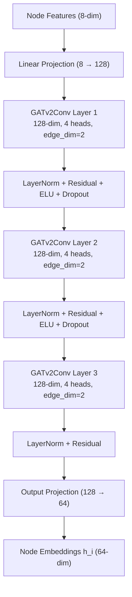
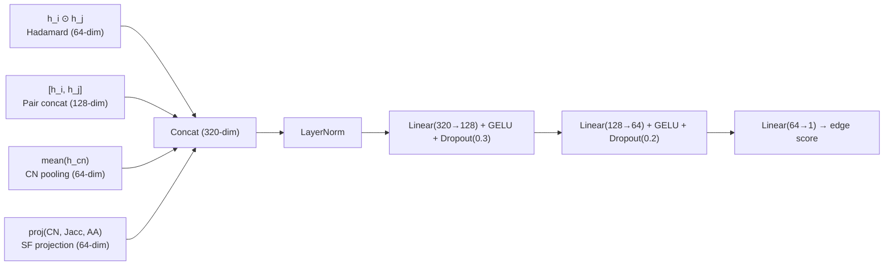

# GNN Edge Prediction Pipeline — Complete Explanation

## 1. From Segmentation Masks to Graphs

The GNN pipeline receives **binary segmentation masks** produced by the non-GNN pipeline (Phase 3: DeepLabV3+ segmentation). Each mask is a 224×224 tensor where 1 = tumor region, 0 = background. The goal is to convert each mask into a **graph** where nodes are tumor sub-regions and edges represent spatial relationships.

### 1.1 Region Extraction (Nodes)

The [MaskToGraph](file:///home/mushahidintesum/Documents/arche/02_gnn_pipeline.py#L104-L227) class uses **connected component analysis** (OpenCV `connectedComponentsWithStats`) to find distinct contiguous regions in each mask. Each connected blob of white pixels becomes a graph node.

```
Binary Mask (224×224)
  → cv2.connectedComponentsWithStats(mask, connectivity=8)
  → Each connected blob with area ≥ 10 pixels → 1 node
```

**Fallback strategies** (since some masks may have only 1 blob):
- If fewer than 3 regions found → **grid splitting**: divide mask into a 4×4 grid, each non-empty cell becomes a node
- If still not enough → **jittered duplication**: slightly perturb existing regions to create minimum 3 nodes

> **Rationale**: A minimum of 3 nodes ensures the graph has meaningful structure for message passing. Grid splitting preserves spatial information when the tumor is a single connected mass.

### 1.2 Node Features (8 dimensions)

Each node (region) gets an **8-dimensional feature vector** encoding its morphological properties:

| Dim | Feature | Formula | What it captures |
|-----|---------|---------|-----------------|
| 0 | `cx / img_size` | Centroid X, normalized to [0,1] | Horizontal position in the image |
| 1 | `cy / img_size` | Centroid Y, normalized to [0,1] | Vertical position in the image |
| 2 | `area / (img_size²)` | Region area, normalized | How large the region is relative to the full image |
| 3 | `width / img_size` | Bounding box width, normalized | Horizontal extent of the region |
| 4 | `height / img_size` | Bounding box height, normalized | Vertical extent of the region |
| 5 | `mean_intensity` | Mean pixel value within region | Mask confidence (from DeepLabV3+) |
| 6 | `aspect_ratio` | width / height | Shape elongation (circular vs. elliptical) |
| 7 | `solidity` | area / (width × height) | How "filled" the bounding box is (compact vs. irregular) |

> **Rationale**: These features capture **where** a region is (dims 0-1), **how big** it is (dims 2-4), **how confident** the segmentation is (dim 5), and **what shape** it has (dims 6-7). All are normalized to roughly [0,1] to prevent any single feature from dominating.

### 1.3 Edge Construction (KNN Graph)

Edges are created using **K-Nearest Neighbors** (k=5) based on spatial centroid distance:

```python
edge_index = knn_graph(pos, k=5, loop=False)  # directed KNN
edge_index = to_undirected(edge_index)          # make symmetric
```

Each node connects to its 5 closest neighbors. The graph is then made **undirected** (if A→B exists, B→A is added).

> **Rationale**: KNN graphs naturally model spatial proximity — tumor sub-regions that are physically close are more likely to interact. k=5 provides enough connectivity for message passing without creating a fully connected graph (which would lose spatial structure).

### 1.4 Edge Features (2 dimensions)

Each edge gets a **2-dimensional attribute vector**:

| Dim | Feature | Formula | What it captures |
|-----|---------|---------|-----------------|
| 0 | `distance` | Euclidean distance / img_size | How far apart the two regions are |
| 1 | `angle` | arctan2(dy, dx) / π | Directional relationship (above/below/left/right) |

> **Rationale**: Distance tells the model *how close* two regions are; angle tells it *in which direction*. Together they encode the full spatial relationship between connected regions. These are fed directly into the GATv2 attention mechanism as attention biases.

---

## 2. Structural Feature Computation

After graph construction, the [StructuralFeatureComputer](file:///home/mushahidintesum/Documents/arche/02_gnn_pipeline.py#L238-L284) computes **three heuristic features** for every candidate edge pair. These are the core of the NCN (Neural Common Neighbor) approach from **Wang et al., ICLR 2024**.

For a candidate edge between nodes i and j:

| Feature | Formula | What it measures |
|---------|---------|-----------------|
| **CN count** | \|N(i) ∩ N(j)\| / max_degree | How many neighbors i and j share, normalized |
| **Jaccard coefficient** | \|N(i) ∩ N(j)\| / \|N(i) ∪ N(j)\| | Overlap relative to total neighborhood size |
| **Adamic-Adar index** | Σ 1/log(deg(w)) for w ∈ CN(i,j) | Weighted CN count — rare shared neighbors count more |

Additionally, the actual **node indices** of common neighbors are stored, so their embeddings can be pooled in the decoder.

> **Rationale (NCN, ICLR 2024)**: The key insight from the NCN paper is that standard GNNs learn good node embeddings but discard structural context when predicting edges. Common neighbor count is one of the strongest classical link prediction heuristics — two nodes that share many neighbors are much more likely to be connected. By computing these features *outside* the GNN (MPNN-then-SF paradigm), we get the expressiveness of subgraph methods (like SEAL) at the computational cost of a single GNN forward pass.

---

## 3. Model Architecture: NCNEdgePredictor

The model follows the **MPNN-then-SF** architecture from NCN (ICLR 2024):

```
Step 1: Run GNN encoder once → get node embeddings h_i for all nodes
Step 2: For each candidate edge (i,j):
         - Compute structural features (CN, Jaccard, AA)
         - Pool common neighbor embeddings
         - Combine with node pair embeddings
         - MLP → link probability
```

### 3.1 NCNEncoder — 3-Layer GATv2 with Residual Connections



**Component-by-component rationale:**

**Input projection** (`Linear(8 → 128)`):
- Lifts the 8-dim node features into a 128-dim hidden space. Without this, the first GATv2 layer would have to simultaneously learn feature transformation *and* attention — projection separates these concerns.

**GATv2Conv** (Brody et al., ICLR 2022):
- GATv2 computes attention as `a^T · LeakyReLU(W·[h_i || h_j])` — the attention score depends on **both** source and target node features.
- Original GATv1 computes `a^T · [W·h_i || W·h_j]` — this is equivalent to `a_l^T · W·h_i + a_r^T · W·h_j`, meaning the *ranking* of attention scores for a fixed target is the same regardless of the query. GATv2 fixes this expressiveness limitation.
- **4 attention heads**: Each head learns a different "type" of attention (e.g., one head may attend to size similarity, another to spatial proximity). Heads output 32-dim each, concatenated to 128-dim.
- **edge_dim=2**: The 2-dim edge features (distance, angle) are used as **attention biases** — they modulate how much each neighbor influences the target node.

**Residual connections** (`x = norm(conv(x)) + x`):
- Without residuals, gradient signal degrades across 3 layers (especially problematic for small graphs with few message-passing paths). Residuals allow gradients to flow directly to earlier layers.

**LayerNorm** (instead of BatchNorm):
- Our graphs are small (3-20 nodes) and variable-sized. BatchNorm computes statistics across all nodes in a batch, which is unstable when graph sizes vary widely. LayerNorm normalizes each node's features independently.

**3 layers** (instead of the original 2):
- Each GATv2 layer aggregates 1-hop neighborhoods. With k=5 KNN and 3 layers, each node's embedding captures information from its **3-hop neighborhood** — covering the entire tumor in most cases.
- The last layer omits ELU/Dropout to preserve the raw representation for the output projection.

### 3.2 NCNEdgeDecoder — MPNN-then-SF (NCN, ICLR 2024)

For each candidate edge (i, j), the decoder constructs a **320-dimensional edge representation** from 4 sources:



**Each signal source and why it matters:**

**(1) Hadamard product `h_i ⊙ h_j`** (64-dim):
- Element-wise multiplication of embeddings. If h_i[k] and h_j[k] are both large, the product is large — this captures **per-dimension feature agreement**. It's a richer similarity signal than dot product (which collapses to a scalar).

**(2) Concatenation `[h_i, h_j]`** (128-dim):
- Preserves the individual identity of both nodes. The MLP can learn **asymmetric** patterns (e.g., "a large region connected to a small region" vs. "two large regions connected").

**(3) Common neighbor pooling `mean(h_cn for cn ∈ CN(i,j))`** (64-dim):
- **This is the key NCN innovation.** For each candidate edge, we find which nodes are neighbors of *both* i and j, then average their embeddings. This tells the decoder: "what do the shared neighbors of i and j look like?"
- If i and j share neighbors that are similar to both of them, there's strong structural evidence for a link.
- If CN(i,j) is empty, this signal is a zero vector — the MLP learns to rely on the other signals in that case.

**(4) Structural feature projection `Linear(3 → 64)`** (64-dim):
- Projects the 3 hand-crafted heuristics (CN count, Jaccard, Adamic-Adar) into the same embedding space. These are simple but powerful classical link prediction features that have been competitive with neural methods for decades.
- Adamic-Adar is particularly useful: it weighs rare shared neighbors more heavily (a shared neighbor with degree 2 is more informative than one with degree 20).

**MLP architecture:**
- LayerNorm stabilizes the concatenated 320-dim input (components have different scales)
- GELU activation (smoother than ReLU, better gradient flow)
- Decreasing dropout (0.3 → 0.2 → 0) — more regularization early, less at the final prediction

### 3.3 Why This Architecture Over Alternatives

| Approach | Expressiveness | Cost | Our choice |
|----------|---------------|------|------------|
| **Dot product decoder** (GAE/VGAE) | Low — only captures linear similarity | O(1) per edge | ✗ Too simple |
| **Concat MLP** (our old approach) | Medium — no structural context | O(1) per edge | ✗ No CN info |
| **SEAL subgraph extraction** | Very high — full local structure | O(k-hop subgraph) per edge | ✗ Too expensive |
| **NCN (ours)** | High — CN pooling + structural features | O(CN lookup) per edge | ✓ Best tradeoff |

---

## 4. Training

### 4.1 Degree-Biased Negative Sampling

Instead of sampling negative edges uniformly at random, we sample node pairs proportional to their degree:

```
prob(node n as neg endpoint) ∝ degree(n) + 1
```

> **Rationale**: Uniform negative sampling creates "easy" negatives — two random nodes that are far apart and obviously not connected. Degree-biased sampling preferentially creates negatives involving high-degree nodes, which are structurally harder to distinguish from positives. This is inspired by the HeaRT evaluation protocol (Galkin et al., 2023).

### 4.2 Loss Function

Standard binary cross-entropy on positive and negative edges:

```
loss = BCE(pos_pred, 1) + BCE(neg_pred, 0)
```

### 4.3 Optimization

- **AdamW** (lr=5e-4, weight_decay=1e-4)
- **OneCycleLR** scheduler — ramps up then decays, prevents early overfitting
- **Gradient clipping** (max_norm=1.0) — stabilizes training on small variable-size graphs

### 4.4 Evaluation Metrics

- **AUC-ROC**: Area under the ROC curve — how well the model separates positive from negative edges across all thresholds
- **Average Precision**: Area under the precision-recall curve — more informative when positives are rare

---

## 5. Reasoning Traces

The [ReasoningTraceGenerator](file:///home/mushahidintesum/Documents/arche/02_gnn_pipeline.py#L432-L525) produces human-readable explanations for each edge prediction by combining:

1. **Spatial context**: distance and angle between regions
2. **Morphological context**: area ratio, solidity
3. **Embedding context**: cosine similarity of learned representations
4. **Structural context** (new): CN count, Jaccard coefficient, common neighbor identities
5. **Attention context** (new): per-layer attention weight means from GATv2

Example output:
```
Edge (2→5): strong link (conf=0.92).
Reasoning: spatially proximate regions; similar region sizes;
high embedding similarity suggests shared morphological features;
strong common neighbor overlap (CN=0.45, Jaccard=0.33).
```
